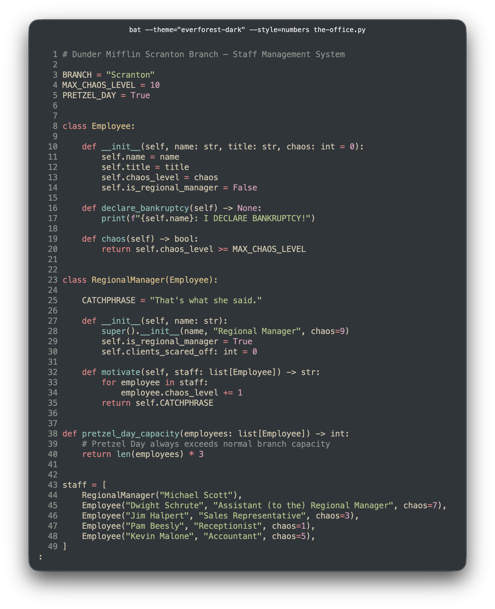
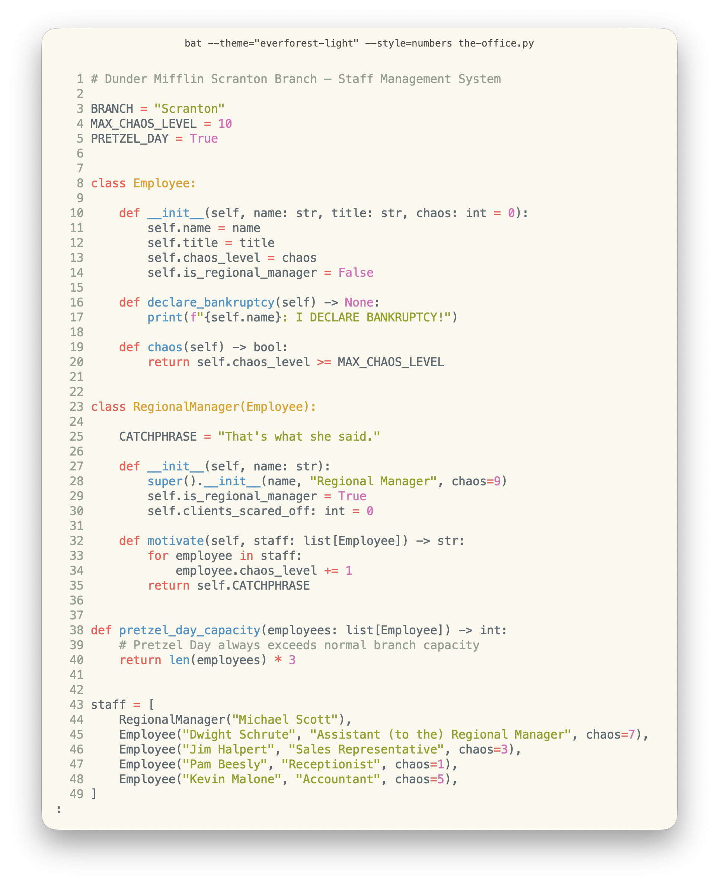

<h1 align="center">🌲 Everforest for bat</h1>

<p align="center">Everforest is a green-based color scheme designed to be warm and soft in order to protect developers' eyes. This repo brings dark and light themes to <a href="https://github.com/sharkdp/bat">bat</a>, based on the original <a href="https://github.com/sainnhe/everforest">Everforest</a> scheme by <a href="https://github.com/sainnhe">sainnhe</a>.</p>

## Previews

<table>
  <thead>
    <tr>
      <th width="50%">Dark</th>
      <th width="50%">Light</th>
    </tr>
  </thead>
  <tbody>
    <tr>
      <td></td>
      <td></td>
    </tr>
  </tbody>
</table>

Screenshots use [Meslo LG Nerd Font](https://github.com/ryanoasis/nerd-fonts/tree/master/patched-fonts/Meslo).

<details>
<summary>Sample code used in screenshots</summary>

```python
# Dunder Mifflin Scranton Branch — Staff Management System

BRANCH = "Scranton"
MAX_CHAOS_LEVEL = 10
PRETZEL_DAY = True


class Employee:

    def __init__(self, name: str, title: str, chaos: int = 0):
        self.name = name
        self.title = title
        self.chaos_level = chaos
        self.is_regional_manager = False

    def declare_bankruptcy(self) -> None:
        print(f"{self.name}: I DECLARE BANKRUPTCY!")

    def chaos(self) -> bool:
        return self.chaos_level >= MAX_CHAOS_LEVEL


class RegionalManager(Employee):

    CATCHPHRASE = "That's what she said."

    def __init__(self, name: str):
        super().__init__(name, "Regional Manager", chaos=9)
        self.is_regional_manager = True
        self.clients_scared_off: int = 0

    def motivate(self, staff: list[Employee]) -> str:
        for employee in staff:
            employee.chaos_level += 1
        return self.CATCHPHRASE


def pretzel_day_capacity(employees: list[Employee]) -> int:
    # Pretzel Day always exceeds normal branch capacity
    return len(employees) * 3


staff = [
    RegionalManager("Michael Scott"),
    Employee("Dwight Schrute", "Assistant (to the) Regional Manager", chaos=7),
    Employee("Jim Halpert", "Sales Representative", chaos=3),
    Employee("Pam Beesly", "Receptionist", chaos=1),
    Employee("Kevin Malone", "Accountant", chaos=5),
]

if PRETZEL_DAY:
    capacity = pretzel_day_capacity(staff)
    print(f"Scranton capacity today: {capacity}")
```

</details>

## Installation

```sh
git clone --depth=1 --no-tags https://github.com/vasylromanets/everforest-bat /tmp/everforest-bat
mkdir -p "$(bat --config-dir)/themes"
cp /tmp/everforest-bat/themes/*.tmTheme "$(bat --config-dir)/themes/"
rm -rf /tmp/everforest-bat
bat cache --build
```

## Usage

Set a fixed theme in your bat config file (`$(bat --config-dir)/config`):

```
--theme="everforest-dark"
```

Or let bat switch automatically based on your terminal's appearance:

```
--theme=auto
--theme-dark="everforest-dark"
--theme-light="everforest-light"
```

## Community Resources

The following are unofficial resources where you can find Everforest ports for other apps and tools:
- [Everforest Website](https://everforest.vercel.app)
- [Everforest Collection](https://github.com/neuromaancer/everforest_collection)

## License

[MIT](./LICENSE)
